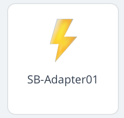

# sonnenAdapter01 für Fibaro HC3
QuickApp für die sonnenBatterie EC8.0 und Eco10.0

## Kurzbeschreibung
Die QuickApp liest ausgewählte Betriebsdaten der sonnenBatterie über deren API-Schnittstelle aus und stellt diese in der QuickApp als Übersicht zur Verfügung. Die Daten werden regelmäßig zyklisch ausgelesen.

## Settings
In den Variablen der QuickApp können die folgenden Parameter voreingestellt werden

1. "ip" - IP-Adresse der sonnenBatterie
2. "wait" - Schalter, damit kann die QuickApp in den Leerlauf versetzt werden (wait= 'yes')
3. "interval" - Zeiteinstellung für den Abfragezyklus der Batteriedaten (interval= '60' steht für 60 Sekunden = 1 Minute)

Hinweis: der Parameter <interval> wird im unteren Bereich aus 30 Sekunden begrenzt, damit die Batterie noch weitere Datenabfragen bedienen kann.

## Globale Variablen
Die folgenden Livedaten werden von der QuickApp auch simultan im zentralen Bereich für globale Variablen abgespeichert. Damit wird die Möglichkeit geschaffen, die Werte bzw. die Zustandswerte der Variablen auch für Automatisierungen in Szenen zu verwenden.

#### sbTimeStamp
  Zeitstempel für die letzte Messung.
  Der Zeitstempel zeigt das Datum in der Form <yyyy-mm-dd> und die Uhrzeit in der Form <hh:mm.ss> an  

#### sbSystemstatus
  Systemstatus der sonnenBatterie. 
  Die Statuswerte <OnGrid> bzw.<OffGrid> werden aus der API übernommen.

#### sbProduction 
  Erzeugung der Photovoltaikanlage in kWh zum Zeitpunkt der Datenabfrage

### sbConsumption 
  Verbrauch in kWh zum Zeitpunkt der Datenabfrage

#### sbGridFeedIn
  Netzeinspeisung bzw. Netzbezug in kWh zum Zeitpunkt der Datenabfrage

#### sbPac_total
  Ladung bzw. Entladung der sonnenBatterie in kWh zum Zeitpunkt der Datenabfrage. 
  Bei Ladung der Batterie wird ein negativer Wert angezeigt; bei Entladung der    Batterie wird ein positiver Wert angezeigt

#### sbRSOC
  Ladezustand der sonnenBatterie in %. Der Ladezustand der Batterie greift auf die API-Daten zurück, der Wertebereich liegt zwischen 0% und 100%
  
# Voraussetzungen
Für die Nutzung des sonnenAdapters01 ist ein Fibaro-SmartHome-System erforderlich. QuickApps sind Erweiterungen des Funktionsumfangs des Hubs, die als "Geräte" verwaltet werden.

## Ansichten
### Datenübersicht
!
  
  
  
  
  
