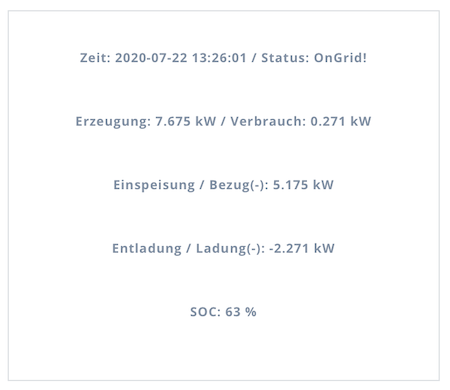
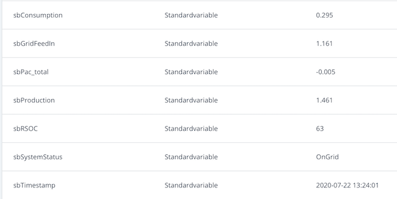

|sbAdapter für Fibaro HC3               |für sonnenBatterie Eco8.0 und Eco10.0    |
|:-------------------------------------:|:------------------------------------:|
|   |             |

# sonnenAdapter01 für Fibaro HC3
QuickApp für die sonnenBatterie EC8.0 und Eco10.0

## Kurzbeschreibung
Die QuickApp liest ausgewählte Betriebsdaten der sonnenBatterie über deren API-Schnittstelle aus und stellt diese in der QuickApp als Übersicht zur Verfügung. Die Daten werden regelmäßig zyklisch aus der API ausgelesen.

## Settings
In den Variablen der QuickApp können die folgenden Parameter voreingestellt werden

1. **ip** - IP-Adresse der sonnenBatterie in der Form 999:999:999:99
2. **wait** - Schalter, damit kann die QuickApp in den Leerlauf versetzt werden (wait= **yes**)
3. **interval** - Zeiteinstellung für den Abfragezyklus der Batteriedaten (interval= **60** steht für 60 Sekunden = 1 Minute)

Hinweis: der Parameter **interval** wird im unteren Bereich aus 30 Sekunden begrenzt, damit die Batterie noch weitere Datenabfragen bedienen kann.

## Globale Variablen
Die folgenden Livedaten werden von der QuickApp auch simultan im zentralen Bereich für globale Variablen abgespeichert. Damit wird die Möglichkeit geschaffen, die Werte bzw. die Zustandswerte der Variablen auch für Automatisierungen in Szenen zu verwenden.

**sbTimeStamp**
  Zeitstempel für die letzte Messung.
  Der Zeitstempel zeigt das Datum in der Form <yyyy-mm-dd> und die Uhrzeit in der Form <hh:mm.ss> an  

**sbSystemstatus**
  Systemstatus der sonnenBatterie. 
  Die Statuswerte <OnGrid> bzw.<OffGrid> werden aus der API übernommen.

**sbProduction** 
  Erzeugung der Photovoltaikanlage in kWh zum Zeitpunkt der Datenabfrage

**sbConsumption** 
  Verbrauch in kWh zum Zeitpunkt der Datenabfrage

**sbGridFeedIn*
  Netzeinspeisung (**positiver Wert**) bzw. Netzbezug (**negativer Wert**) in kWh zum Zeitpunkt der Datenabfrage

**sbPac_total**
  Ladung bzw. Entladung der sonnenBatterie in kWh zum Zeitpunkt der Datenabfrage. 
  Bei **Ladung** der Batterie wird ein **negativer Wert** angezeigt, bei **Entladung** der Batterie wird ein **positiver Wert** angezeigt

**sbRSOC**
  Ladezustand der sonnenBatterie in %. Der Ladezustand der Batterie greift auf die API-Daten zurück, der Wertebereich liegt zwischen 0% und 100%
  
## Voraussetzungen
Für die Nutzung des sonnenAdapters01 ist ein Fibaro-SmartHome-System erforderlich. QuickApps sind Erweiterungen des Funktionsumfangs des Hubs, die als "Geräte" verwaltet werden.

## Ansichten
**Datenübersicht**

Die Datenübersicht wird in der QuickApp angezeigt, dort werden ausgewählte Leistungsdaten der sonnenBatterie als Livedaten angezeigt.

**Globale Variablen**

Die QuickApp speichert Im HC3 im zentralen Bereich für Variablen die aktuell ermittelten Werte von der sonnenBatterie ab.
Voraussetzung dafür ist es, das vom Benutzer diese Variablen dort hinzugefügt werden. Dafür müssen die Varaiblennamen in der gleichen Schreibweise eingegeben werden, die hier vorgeben wurden.

Die folgenden globale Variablen sollte der Nutzer im Fibaro HC3 als globale variablen hinzufügen.
1. **sbTimestamp** - Zeitstempel der letzten Datenabfrage
2. **sbSystemStatus** - Systemstatus der Batterie
3. **sbProduction** - Erzeugung der Photovoltaik-Anlage in kWh
4. **sbConsumption** - Verbrauch des Hauses in kWh
5. **GridFeedIn** - Einspeisung bzw. Bezug von Strom in kWh, ein negativer Wert steht für einen Strombezug aus dem öffentlichen Stromnetz bzw. der sonnen-Community.
6. **sbPac_total** - Ladung bzw. Entladung der Batterie in kWh, ein negativer Wert steht für die Ladung der Batterie.
7. **sbRSOC** - Dieser Wert zeigt den Ladestand der Batterie an; die Werte haben einen Bereich von 0% bis 100%.

**QuickApp - lokale Variablen und Parameter**

Innerhalb der QuickApp müssen unter **Variablen** 3 Parameter für die Steurung der App eingegeben werden. Dort werden auch die Anlagenwerte als lokale Variablen nochmals angezeigt.

Die **Parameter** der QuickApp sind auf die folgenden Standardwerre eingestellt:

1. **ip** = **change-id**. Dieser Parameter ist durch die IP-Adresse der eigenen sonnenBatterie zu ersetzen. Dafür rechts das Symbol mit dem Bleistift wählen, die IP-Adresse eingeben und den Wert abspeichern.

2. **interval** = **60**. Dieser Standardwert steht für einen Abfragezyklus von ca. 60 Sekunden bzw. 1 Minute. Der Wert kann gößer oder kleiner eingegeben werden. Es wird empfohohlen, den Wert für das Interval nicht kleiner als auf 30 (Sekunden) einzustellen.

3. **wait** = **no**. Mit diesem Parameter kann der Benutzer einen Wartezustand für die Datenabfrage aktivieren, die QuickApp fragt dann die Batterie nicht ab (eingebaut, weil im HC3 für QuickApps eine Schalter zum Deaktivieren der App fehlt, wodurch die App ständig läuft).

  
  
